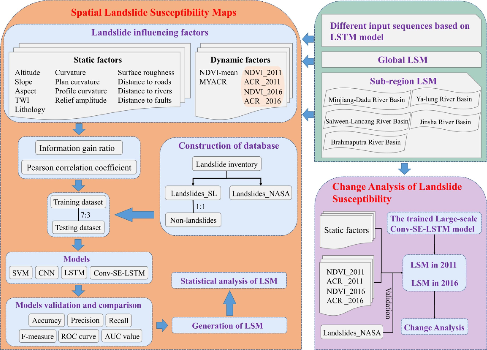

<div align="center">
    <h2>
        DL-LSM   
    </h2>
</div>

<div align="center">
    
</div>


## Introduction

The office code of [Landslide susceptibility mapping and dynamic response along the Sichuan-Tibet transportation corridor using deep learning algorithms](https://doi.org/10.1016/j.catena.2022.106866).
 
The current branch has been tested under PaddlePaddle 2.x and CUDA 10.2, supports Python 3.8+, and is compatible with most CUDA versions.

### Dependencies

- Linux or Windows
- GDAL
- Python 3.7+
- PaddlePaddle 2.0.1 or higher
- CUDA 10.2 or higher
- other environment requirements are updating

### /Common_use：All codes

### Just run *main_use.py* or *main_use_txt.py and parameters.txt*.

```shell
python main_use.py
or
python main_use_txt.py
```

### Other specific file descriptions will updates in the further.


----
## Others:

### ***Relevant literature: DOI: https://doi.org/10.1016/j.catena.2022.106866***

### ***If you use this toolbox in your research, please cite to the literature as follows:***  
***Huang, W., Ding, M., Li, Z., Yu, J., Ge, D., Liu, Q., Yang, J. Landslide susceptibility mapping and dynamic response along the Sichuan-Tibet transportation corridor using deep learning algorithms. Catena. 2023, 222. https://doi.org/10.1016/j.catena.2022.106866.***

### ***If you have the problems related to the use of the toolbox with your usage, you can send an email to huangwubiao@chd.edu.cn.***
### ***If you have the problems related to obtain the dataset and code, you can contact the corresponding author.***

## Update records：

  ### - All codes be uploaded in September 2023

## Notification:
Hello, teachers and scholars!

Due to the change of my research direction and other reasons, I may not maintain these codes in the near future. If you have some problems that cannot be solved, you can send the emails to communicate and learn from each other. I deeply apologize for not being able to reply to your emails in time!
Wishing you all good luck in your research and good health!

Developer
