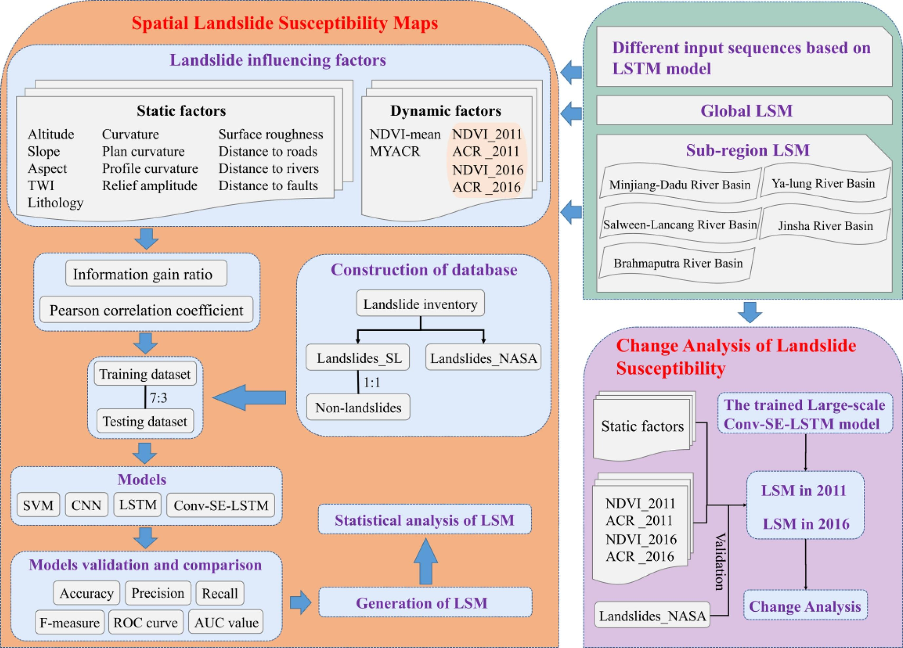
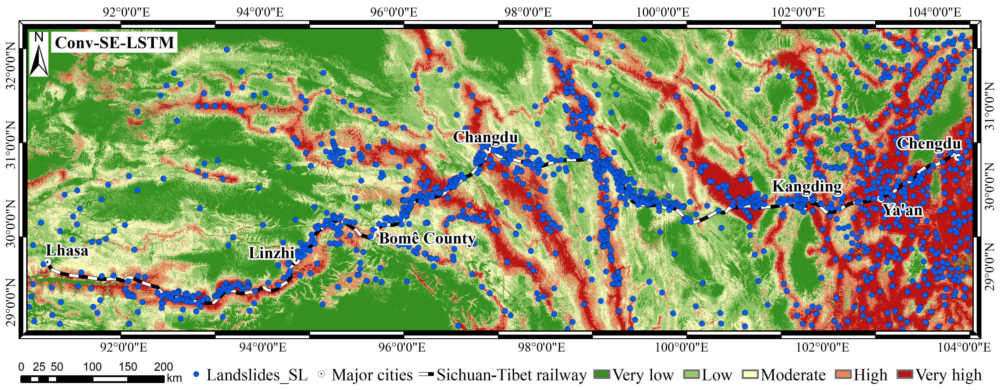
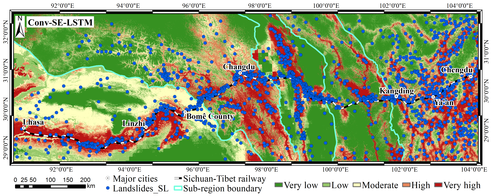

<div align="center">

<h1>Landslide susceptibility mapping and dynamic response along the Sichuan-Tibet transportation corridor using deep learning algorithms</h1>

<div>
    <h3><strong>DL-LSM (Conv-SE-LSTM)</strong></h3>
</div>

<div>
    <strong>Wubiao Huang</strong>, Mingtao Ding*, Zhenhong Li*, Junchuan Yu, Daqing Ge, Qi Liu, Jing Yang
</div>

<div>
    <h4 align="center">
        This repository is an official implementation of  <a href="https://doi.org/10.1016/j.catena.2022.106866" target='_blank'>[Paper]</a> <a href="https://github.com/HuangWBill/DL-LSM/blob/master/paper.pdf" target='_blank'>[PDF]</a>
    </h4>
</div>

</div>




___________

## Table of Contents
* [News](#News)
* [Abstract](#Abstract)
* [Dependencies](#Dependencies)
* [Usage](#Usage)
* [Results](#Results)
* [Citation](#Citation)
* [Contact](#Contact)
* [Notification](#Notification)
___________

## News
- [2024-10-17] Rewrite the readme.md.
- [2024-07-20] The code have been released.
- [2023-07-20] The code have been organized.
- [2022-12-09] The paper has been accepted by Catena.

## Abstract
> *Landslides are one of the most serious natural hazards along the Sichuan-Tibet transportation corridor, which crosses the most complicated region in the world in terms of topography and geology. Landslide susceptibility mapping (LSM) is in high demand for risk assessment and disaster reduction in this mountainous region. A new model, namely Convolutional-Squeeze and Excitation-long short-term memory network (Conv-SE-LSTM), is proposed to map landslide susceptibility along the Sichuan-Tibet transportation corridor. Compared with conventional deep learning models, the proposed Conv-SE-LSTM adaptively emphasizes the contributing features of the conditioning factors by Squeeze and Excitation network (SE), and elaborately arranges the input order of the conditioning factors to utilize their dependence by long short-term memory network (LSTM). Considering the complex geological conditions and the wide range of the study area, the generalization and robustness of the proposed model are demonstrated from the perspective of global and sub-regions. Our proposed model yielded the best Area Under Curve (AUC) value of 0.8813, which is about 3%, 4% and 8% higher than that obtained by three traditional methods, respectively. An annual scale landslide susceptibility changes analysis method is also presented with an accuracy rate of 93.33%. The dynamic response relationship between landslide susceptibility and conditioning factors is revealed.*

## Dependencies
- Linux or Windows
- GDAL
- Python 3.7+
- PaddlePaddle 2.0.1 or higher
- CUDA 10.2 or higher
- multiprocessing
- seaborn
- pandas
- matplotlib
- scikit-learn

## Usage
```shell
cd /Common_use/
python main_use.py
```
or
```shell
cd /Common_use/
python main_use_txt.py
/Common_use/parameters.txt
```

## Results
> Landslide susceptibility maps (Global prediction) obtained from Conv-SE-LSTM model along the Sichuan-Tibet transportation corridor


> Landslide susceptibility maps (Zone prediction) obtained from Conv-SE-LSTM model along the Sichuan-Tibet transportation corridor


> Variation of the landslide susceptibility index under different NDVI and rainfall conditions: (a) 2011; and (b) 2016.


> Comparison of the robustness of different models: (a) SVM; (b) CNN; (c) LSTM; (d) Conv-SE-LSTM. Note: ② Minjiang-Dadu River Basin; ③ Ya-lung River 
Basin; ④ Jinsha River Basin; ⑤ Salween-Lancang River Basin; and ⑥ Brahmaputra River Basin. 


> Table 1. Performance of the four models along the Sichuan-Tibet transportation corridor. 
<table>
<tr>
<th rowspan=2>Zone</th><th rowspan=2>Models</th><th colspan=5>Sub-region prediction results</th><th colspan=5>Global prediction results</th>
</tr>
<tr>
<td>ACC</td><td>Precision</td><td>Recall</td><td>F-measure</td><td>AUC</td><td>ACC</td><td>Precision</td><td>Recall</td><td>F-measure</td><td>AUC</td>
</tr>
<tr>
<td rowspan=4>①</td><td>SVM</td><td>/</td><td>/</td><td>/</td><td>/</td><td>/</td><td>0.7275</td><td>0.7157</td><td>0.7547</td><td>0.7347</td><td>0.8033</td>
</tr>
<tr>
<td>CNN</td><td>/</td><td>/</td><td>/</td><td>/</td><td>/</td><td>0.7537</td><td>0.7440</td><td>0.7736</td><td>0.7585</td><td>0.8381</td>
</tr>
<tr>
<td>LSTM</td><td>/</td><td>/</td><td>/</td><td>/</td><td>/</td><td>0.7589</td><td>0.7906</td><td>0.7044</td><td>0.7450</td><td>0.8484</td>
</tr>
<tr>
<td>Conv-SE-LSTM</td><td>/</td><td>/</td><td>/</td><td>/</td><td>/</td><td>0.8040</td><td>0.8085</td><td>0.7966</td><td>0.8025</td><td>0.8813</td>
</tr>

<tr>
<td rowspan=4>②</td><td>SVM</td><td>0.7431</td><td>0.7273</td><td>0.7778</td><td>0.7517</td><td>0.7963</td><td>0.7083</td><td>0.6471</td><td>0.9167</td><td>0.7586</td><td>0.7821</td>
</tr>
<tr>
<td>CNN</td><td>0.7639</td><td>0.7375</td><td>0.8194</td><td>0.7763</td><td>0.8499</td><td>0.8160</td><td>0.7433</td><td>0.9653</td><td>0.8399</td><td>0.8992</td>
</tr>
<tr>      
<td>LSTM</td><td>0.7569</td><td>0.7569</td><td>0.7569</td><td>0.7569</td><td>0.8359</td><td>0.7882</td><td>0.7456</td><td>0.8750</td><td>0.8051</td><td>0.8504</td>
</tr>
<tr>         
<td>Conv-SE-LSTM</td><td>0.7674</td><td>0.7619</td><td>0.7778</td><td>0.7698</td><td>0.8371</td><td>0.8125</td><td>0.7473</td><td>0.9444</td><td>0.8344</td><td>0.8707</td>
</tr>

<tr>       
<td rowspan=4>③</td><td>SVM</td><td>0.7447</td><td>0.7805</td><td>0.6809</td><td>0.7273</td><td>0.8352</td><td>0.6809</td><td>0.6491</td><td>0.7872</td><td>0.7115</td><td>0.8176</td>
</tr>
<tr>          
<td>CNN</td><td>0.9149</td><td>0.9333</td><td>0.8936</td><td>0.9130</td><td>0.9461</td><td>0.8830</td><td>0.8333</td><td>0.9574</td><td>0.8911</td><td>0.9715</td>
</tr>
<tr>          
<td>LSTM</td><td>0.8511</td><td>0.8667</td><td>0.8298</td><td>0.8478</td><td>0.9181</td><td>0.8404</td><td>0.8636</td><td>0.8085</td><td>0.8352</td><td>0.9208</td>
</tr>
<tr>         
<td>Conv-SE-LSTM</td><td>0.8936</td><td>0.9302</td><td>0.8511</td><td>0.8889</td><td>0.9579</td><td>0.8617</td><td>0.8400</td><td>0.8936</td><td>0.8660</td><td>0.9457</td>
</tr>

<tr>
<td rowspan=4>④</td><td>SVM</td><td>0.7294</td><td>0.7315</td><td>0.7248</td><td>0.7281</td><td>0.8209</td><td>0.6284</td><td>0.5972</td><td>0.7890</td><td>0.6798</td><td>0.7775</td>
</tr>
<tr>
<td>CNN</td><td>0.7661</td><td>0.7458</td><td>0.8073</td><td>0.7753</td><td>0.8681</td><td>0.8440</td><td>0.8049</td><td>0.9083</td><td>0.8534</td><td>0.9156</td>
</tr>
<tr>
<td>LSTM</td><td>0.7706</td><td>0.7921</td><td>0.7339</td><td>0.7619</td><td>0.8285</td><td>0.7890</td><td>0.8058</td><td>0.7615</td><td>0.7830</td><td>0.8615</td>
</tr>
<tr>
<td>Conv-SE-LSTM</td><td>0.7982</td><td>0.8095</td><td>0.7798</td><td>0.7944</td><td>0.8755</td><td>0.8119</td><td>0.8208</td><td>0.7982</td><td>0.8093</td><td>0.8849</td>
</tr>

<tr>
<td rowspan=4>⑤</td><td>SVM</td><td>0.7629</td><td>0.7802</td><td>0.7320</td><td>0.7553</td><td>0.8444</td><td>0.7010</td><td>0.7600</td><td>0.5876</td><td>0.6628</td><td>0.7642</td>
</tr>
<tr>
<td>CNN</td><td>0.8351</td><td>0.8155</td><td>0.8660</td><td>0.8400</td><td>0.9039</td><td>0.8814</td><td>0.9022</td><td>0.8557</td><td>0.8783</td><td>0.9463</td>
</tr>
<tr>
<td>LSTM</td><td>0.7732</td><td>0.8118</td><td>0.7113</td><td>0.7582</td><td>0.8652</td><td>0.7629</td><td>0.8400</td><td>0.6495</td><td>0.7326</td><td>0.8943</td>
</tr>
<tr>
<td>Conv-SE-LSTM</td><td>0.8196</td><td>0.7768</td><td>0.8969</td><td>0.8325</td><td>0.8971</td><td>0.8144</td><td>0.8280</td><td>0.7938</td><td>0.8105</td><td>0.8965</td>
</tr>

<tr>
<td rowspan=4>⑥</td><td>SVM</td>
<td>0.6707</td><td>0.6296</td><td>0.8293</td><td>0.7158</td><td>0.7827</td><td>0.7317</td><td>0.7714</td><td>0.6585</td><td>0.7105</td><td>0.8125</td>
</tr>
<tr>
<td>CNN</td><td>0.7195</td><td>0.6800</td><td>0.8293</td><td>0.7473</td><td>0.8175</td><td>0.8720</td><td>0.8861</td><td>0.8537</td><td>0.8696</td><td>0.9304</td>
</tr>
<tr>
<td>LSTM</td><td>0.7256</td><td>0.7033</td><td>0.7805</td><td>0.7399</td><td>0.8236</td><td>0.8171</td><td>0.8939</td><td>0.7195</td><td>0.7973</td><td>0.9210</td>
</tr>
<tr>
<td>Conv-SE-LSTM</td><td>0.7561</td><td>0.7442</td><td>0.7805</td><td>0.7619</td><td>0.8294</td><td>0.8049</td><td>0.8906</td><td>0.6951</td><td>0.7808</td><td>0.9155</td>
</tr>

</table>
 
Notes: ① Global; ② Minjiang-Dadu River Basin; ③ Ya-lung River Basin; ④ Jinsha River Basin; ⑤ Salween-Lancang River Basin; and ⑥ Brahmaputra River Basin. 


## Citation
Please kindly cite the papers if this code is useful and helpful for your research: 
```
@article{HUANG2023106866,
  title = {Landslide susceptibility mapping and dynamic response along the Sichuan-Tibet transportation corridor using deep learning algorithms},
  author = {Wubiao Huang and Mingtao Ding and Zhenhong Li and Junchuan Yu and Daqing Ge and Qi Liu and Jing Yang},
  journal = {CATENA},
  volume = {222},
  pages = {106866},
  year = {2023},
  doi = {https://doi.org/10.1016/j.catena.2022.106866}
}
```

## Contact
If you have the problems related to the use of the code, you can send an email to [Wubiao Huang](huangwubiao@chd.edu.cn).
If you have the problems related to obtain the dataset, you can contact the corresponding author [Mingtao Ding](mingtaiding@chd.edu.cn).

## Notification

> Hello, teachers and scholars!   
>    
> Due to the change of my research direction and other reasons, I may not maintain these codes in the near future. you can send the emails to communicate and learn from each other. I deeply apologize for not being able to reply to your emails in time! Wishing you all good luck in your research and good health!
>
> DL-LSM Developer
>
> 20th July 2024

